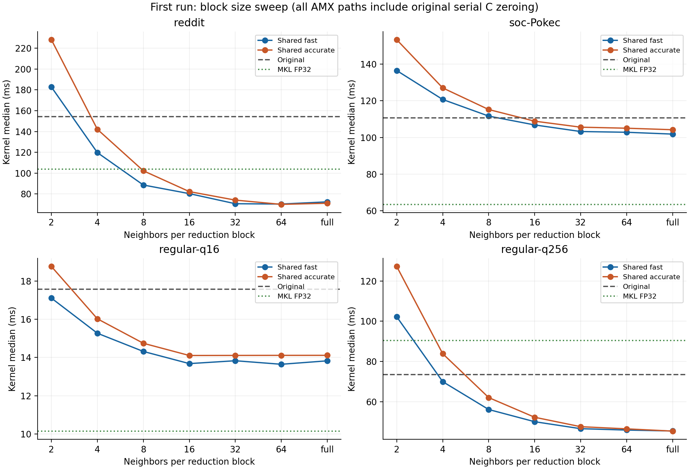
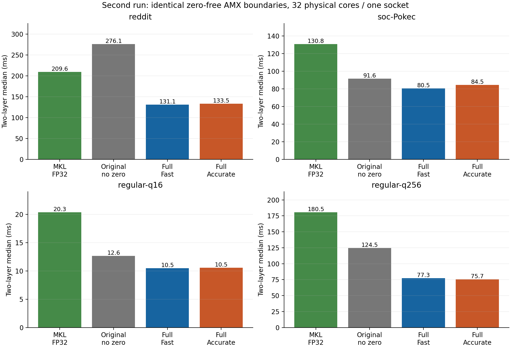

# GCN-extra 首轮推理实验：局部邻居归约与原 TFS 对照

首轮实现、正确性检查、两次独占性能实验已完成。完整 25 图、K 敏感性、度分布二维实验和 checkpoint 准确率尚未完成。所有论文级泛化结论仍为 UNVERIFIED。

## 实验定义与证据

- 第一轮 B sweep：`formal-10861421`；第二轮清零控制：`formal-10861923`。
- 每次只使用一个独占 Xeon Max 9462 节点；实际计算为一个 socket 的 32 个物理核，内存交错于该 socket 的四个 CPU NUMA 域。节点与 CPU mask 见各 run 的 affinity.json、lscpu.txt、benchmark_numa_policy.txt。
- D=F=128，TR=16，R=64；所有路径使用同一原始 CSR、DegreeSort permutation、H/W。真实图全部 CSR values 扫描为 1。已有边和 self-loop 保留，不补边。
- 算子为源码实际实现的 C=(AH)W、单位边权求和；两层为该算子→ReLU→第二层算子。H/W 为固定种子随机输入。这里的两层 E2E 是 prepared sum-aggregation inference，不是已验证任务准确率的归一化 GCN。
- Original、Fast、Accurate 使用相同截断 BF16 H/W；另有 FP32 MKL 和 BF16 输入/权重转回 FP32 的 MKL 参考。Fast 额外量化局部和；Accurate hi+lo 仅改善这一额外量化，不能恢复 H/W 已丢失的精度。
- 一次预热、五次测量，轮换方法顺序；表内为未经分项插桩的中位数。Prepared E2E 包含两个 kernel、ReLU、层间 BF16 转换；初始 H 转换、W packing、DegreeSort、图读取分别在 preprocess.csv，未包含于此 E2E。

## 图与实际布局

| 图 | N | E | 平均度 | 最大度/平均度 | 原 TFS η | Full η |
|---|---:|---:|---:|---:|---:|---:|
| reddit | 232,965 | 114,615,892 | 491.99 | 44.02 | 0.996658 | 0.999953 |
| soc-Pokec | 1,632,803 | 30,622,564 | 18.75 | 467.25 | 0.993542 | 0.999981 |
| regular-q16 | 262,144 | 4,194,304 | 16.00 | 1.00 | 1.000000 | 1.000000 |
| regular-q256 | 262,144 | 67,108,864 | 256.00 | 1.00 | 1.000000 | 1.000000 |

## 第二轮公平对照：kernel 与两层 E2E

所有 Original_nozero 与局部 nozero 方法都移除了冗余全输出清零。相对 Original_nozero 的加速才用于判断归约方法的额外价值。完整源码原版同时保留。

### reddit

| 方法 | kernel ms | 两层 E2E ms | E2E 相对 Original_nozero | E2E 相对 MKL FP32 |
|---|---:|---:|---:|---:|
| MKL FP32 | 103.849 | 209.554 | 1.317× | 1.000× |
| 源码完整原版 | 151.927 | 302.490 | 0.913× | 0.693× |
| 原版，仅移除清零 | 146.007 | 276.087 | 1.000× | 0.759× |
| 局部 Full Fast，移除清零 | 65.203 | 131.147 | 2.105× | 1.598× |
| 局部 Full Accurate，移除清零 | 61.817 | 133.472 | 2.069× | 1.570× |
| 局部 B32 Fast，移除清零 | 61.189 | 128.310 | 2.152× | 1.633× |
| Full Fast 重读对照，移除清零 | 124.041 | 238.797 | 1.156× | 0.878× |

### soc-Pokec

| 方法 | kernel ms | 两层 E2E ms | E2E 相对 Original_nozero | E2E 相对 MKL FP32 |
|---|---:|---:|---:|---:|
| MKL FP32 | 63.745 | 130.801 | 0.701× | 1.000× |
| 源码完整原版 | 112.365 | 225.445 | 0.406× | 0.580× |
| 原版，仅移除清零 | 41.378 | 91.639 | 1.000× | 1.427× |
| 局部 Full Fast，移除清零 | 36.631 | 80.527 | 1.138× | 1.624× |
| 局部 Full Accurate，移除清零 | 38.113 | 84.468 | 1.085× | 1.549× |
| 局部 B32 Fast，移除清零 | 37.314 | 83.355 | 1.099× | 1.569× |
| Full Fast 重读对照，移除清零 | 46.854 | 101.107 | 0.906× | 1.294× |

### regular-q16

| 方法 | kernel ms | 两层 E2E ms | E2E 相对 Original_nozero | E2E 相对 MKL FP32 |
|---|---:|---:|---:|---:|
| MKL FP32 | 10.338 | 20.344 | 0.621× | 1.000× |
| 源码完整原版 | 17.694 | 33.432 | 0.378× | 0.609× |
| 原版，仅移除清零 | 4.536 | 12.634 | 1.000× | 1.610× |
| 局部 Full Fast，移除清零 | 2.898 | 10.470 | 1.207× | 1.943× |
| 局部 Full Accurate，移除清零 | 2.914 | 10.544 | 1.198× | 1.929× |
| 局部 B32 Fast，移除清零 | 2.941 | 10.463 | 1.207× | 1.944× |
| Full Fast 重读对照，移除清零 | 3.677 | 12.566 | 1.005× | 1.619× |

### regular-q256

| 方法 | kernel ms | 两层 E2E ms | E2E 相对 Original_nozero | E2E 相对 MKL FP32 |
|---|---:|---:|---:|---:|
| MKL FP32 | 91.684 | 180.510 | 0.690× | 1.000× |
| 源码完整原版 | 73.323 | 145.403 | 0.857× | 1.241× |
| 原版，仅移除清零 | 60.486 | 124.547 | 1.000× | 1.449× |
| 局部 Full Fast，移除清零 | 36.444 | 77.259 | 1.612× | 2.336× |
| 局部 Full Accurate，移除清零 | 36.756 | 75.676 | 1.646× | 2.385× |
| 局部 B32 Fast，移除清零 | 37.075 | 76.478 | 1.629× | 2.360× |
| Full Fast 重读对照，移除清零 | 53.372 | 108.898 | 1.144× | 1.658× |

## 正确性与精度

先做全矩阵数值比较，再进行性能测量。还对小图全行、真实图按低度/高度/固定种子选取的行做 FP64 聚合与投影参考。NaN 预填充确认 nozero 内核真正写完每个输出元素。

| 图 | 原版去清零与原版 max abs | Full Fast kernel rel L2 | Full Accurate kernel rel L2 | Full Fast E2E rel L2 | Full Accurate E2E rel L2 |
|---|---:|---:|---:|---:|---:|
| reddit | 0.000e+00 | 3.313e-03 | 8.823e-06 | 5.837e-03 | 1.625e-05 |
| soc-Pokec | 0.000e+00 | 3.265e-03 | 4.976e-06 | 5.837e-03 | 3.211e-05 |
| regular-q16 | 0.000e+00 | 3.273e-03 | 1.919e-06 | 5.915e-03 | 3.003e-05 |
| regular-q256 | 0.000e+00 | 3.314e-03 | 7.976e-06 | 5.749e-03 | 2.362e-05 |

第二轮正确性记录 264 条，失败 0 条。空行、全空图、目标行尾块、130 邻居跨块检查均通过。首个全空图因 oneMKL 零 nnz 接口失败的历史记录保留，适配修复见 handoff。Fast/Accurate 的误差相对于相同 BF16 输入/权重参考；相对 FP32 的完整误差另见 correctness.csv。

## 已定位的开销与研究判断

1. 第一轮发现 soc-Pokec 原始串行输出清零约 65.504 ms，而原 kernel 中位数为 110.746 ms；局部路径同样约 65.763 ms 清零。清零掩盖了 sparse 与 AMX 部分的差别。第二轮只去除该冗余操作的 Original_nozero 已通过逐元素完全一致检查。
2. 原 TFS 的 DegreeSort 在 reddit 上已将 η 提高到约 0.997，但逐边投影仍存在：其物理 AMX 模型工作量约 3.768 TFLOP；局部 Full Fast 约 7.634 GFLOP，Accurate 约 15.268 GFLOP。时间不会按工作量同比下降，新的路径增加 FP32 特征归约并受 gather、输出与调度限制。
3. 原 kernel 每个输出 panel 重走邻居。shared 模式只读取/归约一次；replay 对照保留两次读取和归约。二者 AMX 投影工作相同，可观察跨 panel 复用的价值；不能把 shared 的全部收益归结为投影 FLOPs 减少。
4. 两张规则图固定 N=262144，q=16/256，源 ID 生成器、种子和每行邻居前缀规则相同，邻居在一行内不重复。q sweep 仍同时改变 E/数据量，只有两个点，不能据此拟合自适应 B 选择器或宣称完整因果结论。
5. 当前两次实验固定 R=64。尚未复现原论文所有图的速度趋势或重新核对原论文最优 R/绑核/计时环境，完整 S0 仍需 source-faithful 独立 CLI 与 R64/128/256 对照。

## 分项计时位置与边界

每张图的 profiles.csv 包含输出清零、行调度、局部 buffer 清零、CSR/prefetch、feature gather/decode、FP32 邻居归约、BF16 转换、tile load、tile compute、tile store、输出 scatter、线程 AMX setup。MKL 另记录真实 SpMM/GeMM wall time；E2E 的 layer1/activation_conversion/layer2 在 timings.csv。
AMX/归约细项采用独立的抽样插桩运行，每 256 个排序后的 destination tile 取样并包含末尾 tile；这些是所选 tile 的累计线程时间，计时器有开销，不能相加当作总 wall latency，也不能直接当作全图百分比。原版插桩输出与未改动内核逐元素一致。物理 AMX FLOPs、逻辑特征 bytes 和 spill/reload bytes 是源码模型，尚无硬件计数器证据。

## 图表

## 下一步

- 固定当前正确性与 zero-free 强基线，核对原 CLI 和 R64/128/256、DegreeSort 消融；保留 source faithful 原版作为历史锚点。
- 扩展 q sweep 与固定 E 灵敏度，记录度数分位数、真实源节点复用、工作集和 NUMA；再进行 q×skew 二维实验。
- 增加 reddit/mycielskian19/hollywood/products 的外部验证、K 敏感性和硬件计数器；24/25 图全量应先确认内存与 32-bit CSR 边界。
- 任务准确率仅在具备匹配特征、标签、GCN checkpoint 的数据集上检查。

